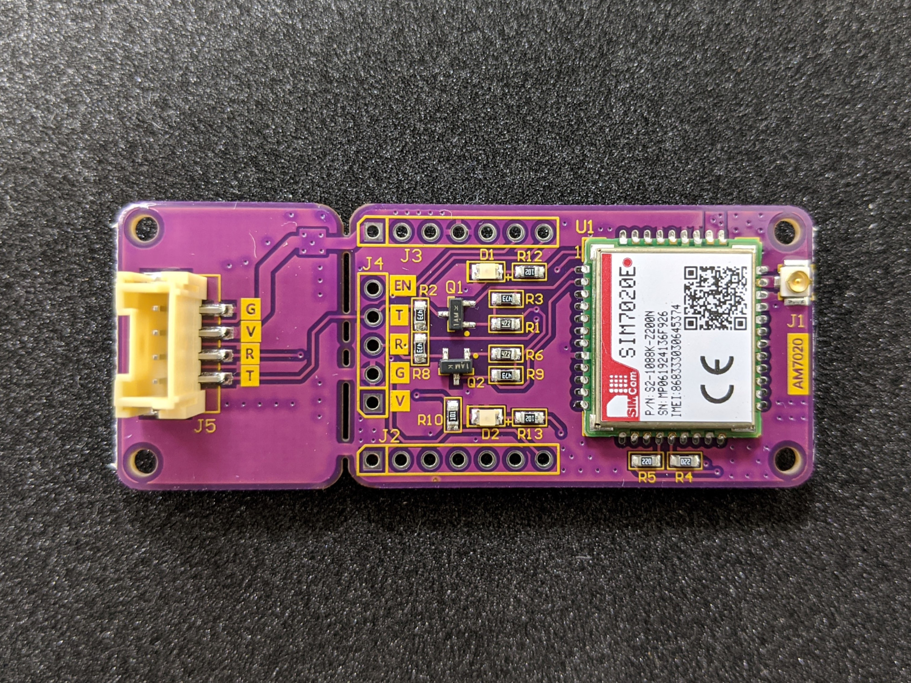

# AM7020 Raspberry Pi 範例程式碼
 [AM7020](https://atticedu.com/index.php/am7020.html) (SIMCOM SIM7020E) 窄頻物聯網(NBIoT)模組 Raspberry Pi 範例程式碼
 
  
  

 Installation
 ------------

 To install am7020:

 ```console
 $ pip install -i https://test.pypi.org/simple/ am7020
 ```
 ## 啟用Raspberry Pi UART
 * Step1: Terminal input sudo raspi-config.
 * Step2: Select Interfacing Options.
 * Step3: Select Serial.
 * Step4: Select "NO".
 * Step5: Select "YES".
 * Step6: Reboot Pi.
 
 ## MQTT 教學說明
 Declare nb and mqtt client instance using:
 ```Python
 nb = SIM7020NB(port="/dev/ttyS0", baudrate=115200, reset_pin=18)
 mqtt = SIM7020MQTT(nb)
 ```
 Initialize nb and connect to NBIOT base station:
 ```Python
 while((not nb.init() or (not nb.nbiotConnect(apn, band)))):
     print(".")
 
 while(not nb.waitForNetwork()):
     print(".")
     sleep(5)
 ```
 Check MQTT connection status and connect to Broker:
 ```Python
 if(not mqtt.chkConnBroker()):
     mqtt.connBroker(MQTT_BROKER, 1883, mqtt_id="MY_AM7020_TEST_MQTTID")
 ```
 Publish and subscribe:
 ```Python
 mqtt.publish(TEST_TOPIC, "Hello MQTT")
 
 def callback1(msg):
     print(TEST_TOPIC, ":", msg)
 mqtt.subscribe(TEST_TOPIC, callback1)
 ```
 Listen for messages from the broker:
 ```Python
 mqtt.procSubs()
 ```
 ## HTTP 教學說明
 Declare nb and http client instance using:
 ```Python
 nb = SIM7020NB(port="/dev/ttyS0", baudrate=115200, reset_pin=18)
 http = SIM7020HTTP(nb, HTTP_SERVER)
 ```
 Initialize nb and connect to NBIOT base station:
 ```Python
 while((not nb.init() or (not nb.nbiotConnect(apn, band)))):
     print(".")
 
 while(not nb.waitForNetwork()):
     print(".")
     sleep(5)
 ```
 HTTP GET and POST:
 ```Python
 http.get(HTTP_GET_API)
 state_code = http.responseStatusCode()
 body = http.responseBody()
 
 http.post(HTTP_POST_API, content_type="application/json", body="{\"value\": \"POST\"}")
 state_code = http.responseStatusCode()
 body = http.responseBody()
 ```
